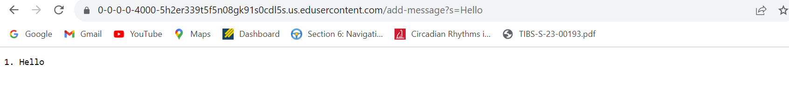
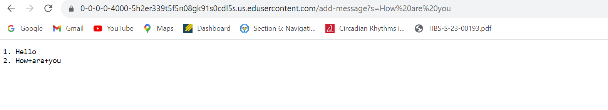
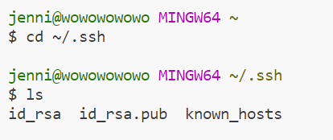
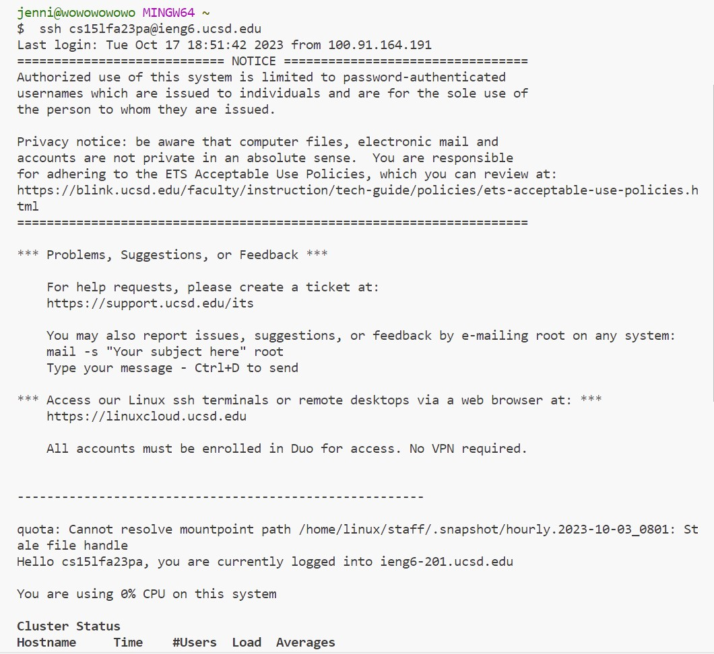

Part1
code of ```StringServer```
```
import java.io.IOException;
import java.net.URI;

class Handler implements URLHandler {
        String result="";
        int num=1;
    public String handleRequest(URI url) {
        if (url.getPath().contains("/add")) {
                String[] word = url.getQuery().split("=");
                    result=result+String.format("%d. "+word[1]+"\n",num);
                    num+=1;
                    }
                    return result;
                }
            }


class StringServer {
    public static void main(String[] args) throws IOException {
        if(args.length == 0){
            System.out.println("Missing port number! Try any number between 1024 to 49151");
            return;
        }

        int port = Integer.parseInt(args[0]);
        Server.start(port, new Handler());
    }
}
```
screenshot of ```/add-message?s=Hello```



The method that is called is ```public String handleRequest(URI url)```.

The relevant argument is the URI https://0-0-0-0-4000-5h2er339t5f5n08gk91s0cdl5s.us.edusercontent.com/add-message?s=Hello, relevant values are String result, int num, and String word. 

By this request, word becomes "Hello", the result changes from null to "1. Hello", and then num goes from 1 to 2.

screenshot of ```/add-message?s=How are you```



The method called is ```public String handleRequest(URI url)```

The relevant argument is the URI https://0-0-0-0-4000-5h2er339t5f5n08gk91s0cdl5s.us.edusercontent.com/add-message?s=How are you. Relevant values are String result, int num, and String word.

By this request, word becomes "How are you", result changes from "1. Hello" to "1. Hello \n 2. How are you", and the num goes from 2 to 3.

Part 2



As shown in the image above, the path to private key is ~/.ssh/id_rsa, and the path to public key is ~/.ssh/id_rsa.pub
login without password:



Part3

I learned about the format of URI such as the format of query and how to write corresponding web output based on the query input. I also learned about writing web server and how to lauch the server. I learned about what is a remote server and how remote server is related to the computer that is being used as well. 

