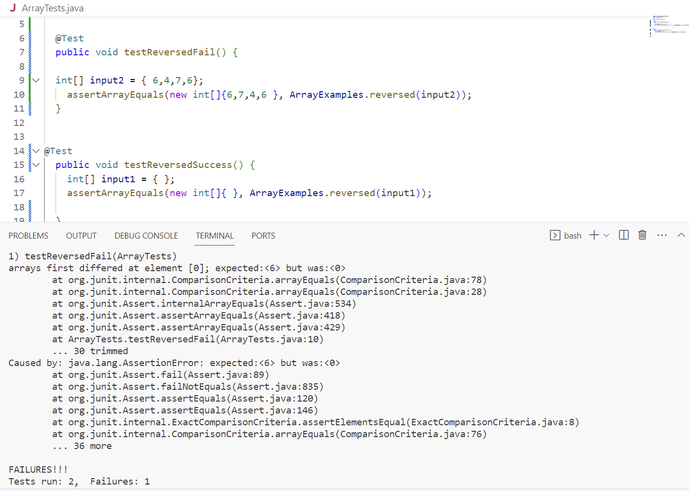

Part1- Bugs

The bug I chose is the method ```reversed```

A failure induced input is:
```
int[] input2 = { 6,4,7,6};
assertArrayEquals(new int[]{6,7,4,6}, ArrayExamples.reversed(input2));
```
An input that does not induce failure is:
```
int[] input1 = { };
assertArrayEquals(new int[]{ }, ArrayExamples.reversed(input1));
```
Symptom:


Before code change:
```
 static int[] reversed(int[] arr) {
    int[] newArray = new int[arr.length];
    for(int i = 0; i < arr.length; i += 1) {
      arr[i] = newArray[arr.length - i - 1];
    }
    return arr;
  }
```

After code change:
```
static int[] reversed(int[] arr) {
    int[] newArray = new int[arr.length];
    for(int i = 0; i < arr.length; i += 1) {
      newArray[i] = arr[arr.length - i - 1];
    }
    return newArray;
  }
```

The fix addresses the issue because for the original code, the code changed elements on the index of the input array to the elements on the reversed index of the newly established array, which has empty elements in all indexes. By changing the code and making the element on index of newly established array change to elements on the reversed index of the input array, and return the new array, we can achieve the intended goal of the code.

Part 2.
