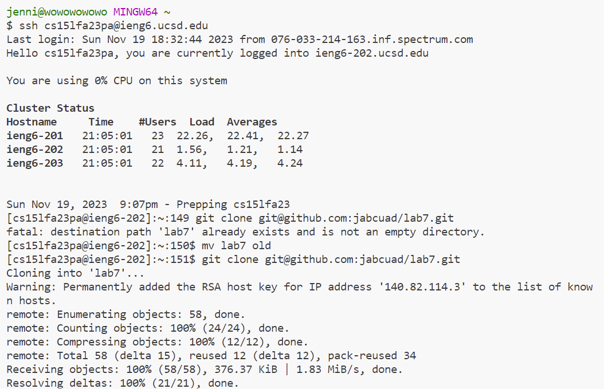
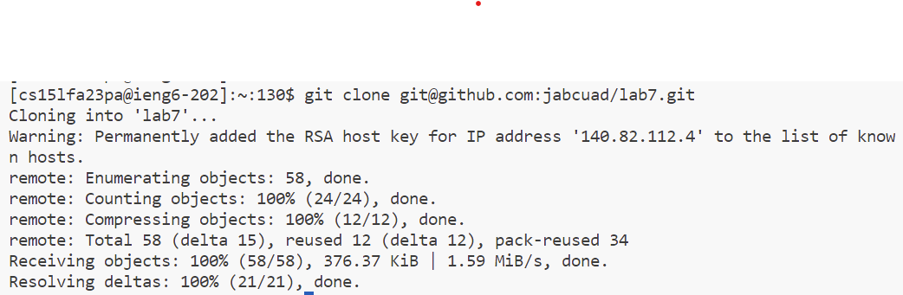
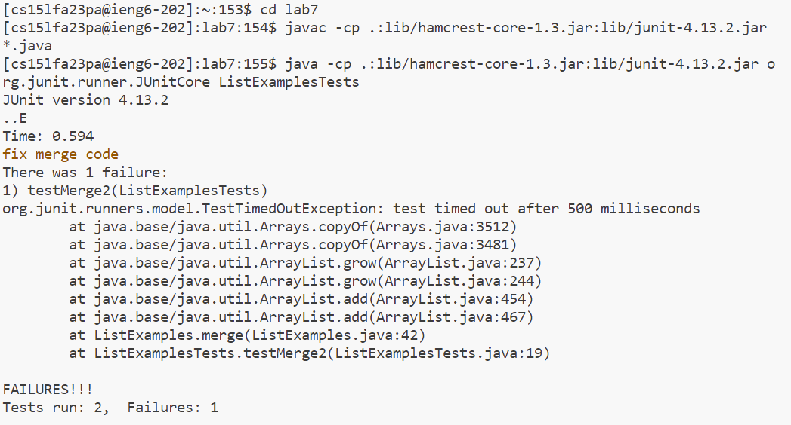
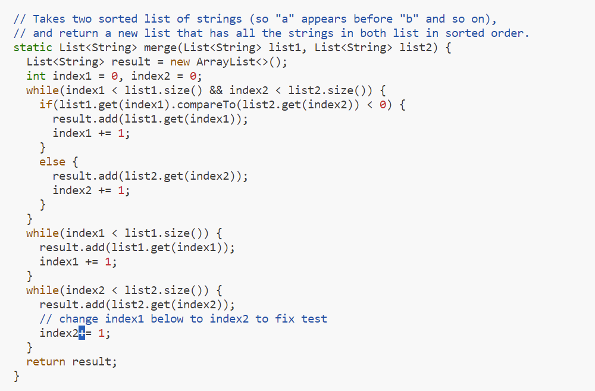
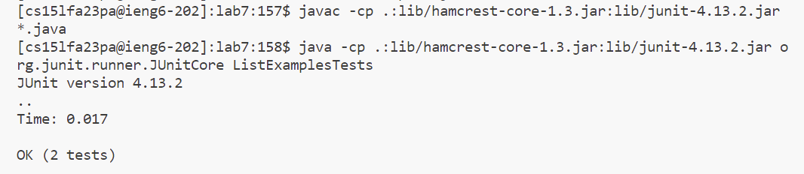
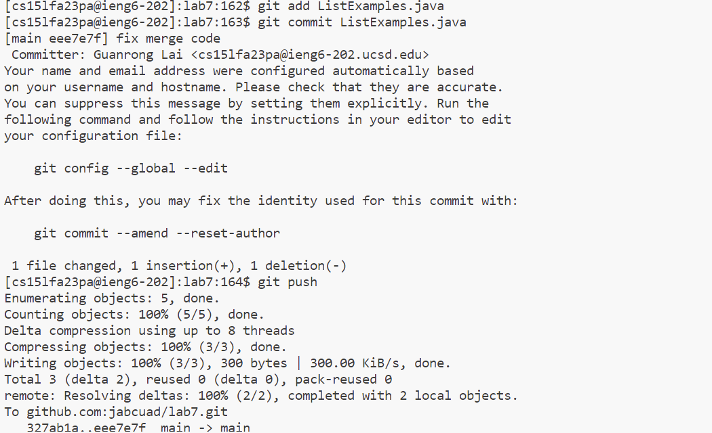

step4:

Keys I pressed are ```ssh cs15lfa23pa@ieng6.ucsd.edu<enter>```. The command I ran is ssh allows me to loginto ieng6 using my laptop. The keypresses allowed me to type the command.

step5:

Keys I pressed are ```git clone git@github.com:jabcuad/lab7.git```, the command allowed me to clone the file lab7 from my github with SSH URL. The keypresses allowed me to type command out.

Step6:

Keys I pressed are ```javac -cp .:lib/hamcrest-core-1.3.jar:lib/junit-4.13.2.jar *.java <enter>``` ```java -cp .:lib/hamcrest-core-1.3.jar:lib/junit-4.13.2.jar org.junit.runner.JUnitCore ListExamplesTests <enter>``` The command I ran compile and run the ```Listexamplestests.java```, the keypresses allowed me to type commands out.

step7:

Keys I pressed are ```vim ListExamples.java <enter>``` Then in vim mode I typed ```:44<enter>dwiindex2<esc>:wq<enter>``` Command I ran first started vim, then edit in vim and quit. The keypresses to enter vim are characters that I typed out for command, the ```:44``` keypress allowed me to go to line 44, the ```dw``` allowed me to delete ```index1``` and ```iindex2```allowed me to go to edit mode and put word ```index2``` in the code, then I typed ```<esc>``` to go out of edit mode and ```:wq``` to save and quit vim.

java file after change:


step8:

Keys I pressed are ```<up><up><up><enter>```, which brought out ```javac -cp .:lib/hamcrest-core-1.3.jar:lib/junit-4.13.2.jar *.java``` and compiles the java files, and then ```<up><up><up><enter>```, which brought out ```java -cp .:lib/hamcrest-core-1.3.jar:lib/junit-4.13.2.jar org.junit.runner.JUnitCore ListExamplesTests``` and run the ```Listexamplestests.java```. The keypresses allowed me to brought the command that I ran in terminal before the last two commands back.

step9:

KeysI pressed are ```git add L <Tab> <Enter>``` ```git commit L<Tab><Enter> i merge fix <esc> :qw``` ```git push``` The ```git add``` allowed me to stage the ```ListExamples.java``` file to be part of next commit, ```git commit``` allowed to commit the vim change of the file locally. The ```git push``` allowed me to update the file I have in my github account with the vim change. The keypress allowed me to type commands out, the ```<Tab>``` press allowed me to quickly complete the name of the java file I want to type without type its whole name out. The keys ```i``` allowed me to gointo vim mode, the keypress in vim mode is similar to step7.
