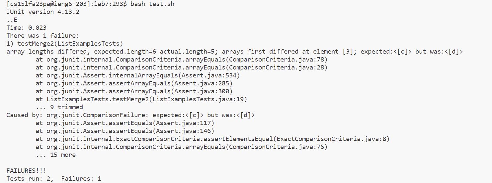
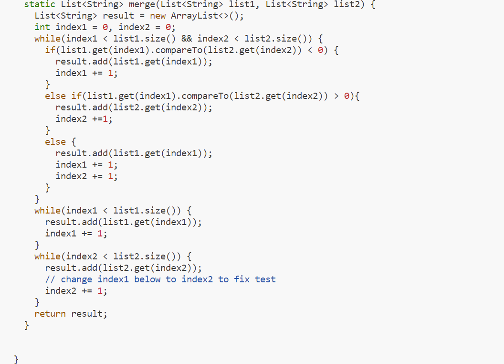
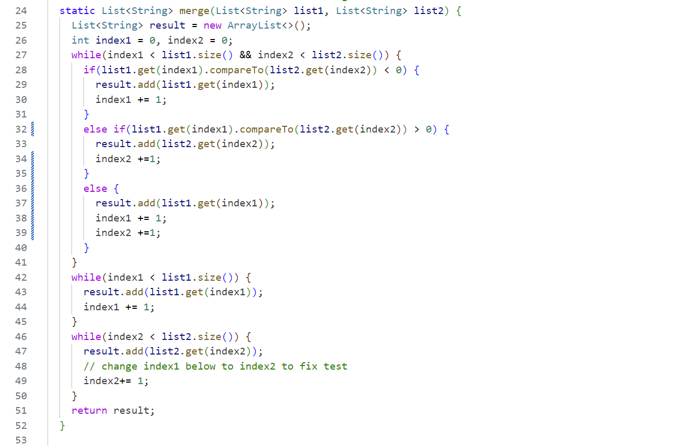

Part 1

1.
Question about ```merge``` method code

Hi, I am working on the method ```merge``` for my week 7 lab, I tried to run the tests for the method through bash but it showed that it didn't pass ```testMerge2```. I think the bug is somewhere in the method ```merge``` but I'm not sure what exactly went wrong. Thanks!

Here's my terminal output that showed failure(my bug symptom):


Here's my merge method:


Here's the code for my second ```merge``` test:


2.

Hi, double check on what the second test for ```merge``` is expecting. What output do we want if there are common letters in both lists?

3.

After seeing the response, the student noticed that when there are common letter in both lists, the letter should appear twice in the result list instead of only appearing it once. Thus the student figured out that they should not increase both ```index1``` and ```index2``` when the values at these two indexes are equal, and they can combine ```<``` case with the equal case since both only require ```index2``` to increase by 1.

Student changed the code for merge to:


now the terminal shows:


File and directory structure:


contents of each file before fixing bug:

```.gitgnore```:


```ListExamples.java```:



```ListExamplesTests.java```":


```test.sh```:


full command line that triggered the bug:


Description of what to edit to fix the bug:
first delete the ```else if``` statement, then change the contents inside the ```else``` statement to increase ```index2``` by 1 instead of increasing both index values, these actions combined case when the lists reach values that are equal or reach values where value at ```index2``` of ```list2``` should be put in the list as it should be sorted before the current value at ```index1``` of ```list1``` and allowing ```index2``` to increase by 1 in these cases.

Part 2

In the second half of the quarter, I learned many new things that I didn't know from lab sections, such as the command line options, the use of bash script and vim, concept of exit code, and jdb debugging. Among all these new learnings, one particular thing I learned was that we can use jdb java debugger to run the code can check value of a variable at a specific line after hitting stop set before the run command. During lecture 15 the lecture showed how to check value of s1 and s2 variables in the middle of code running to see which line generated bug.  
